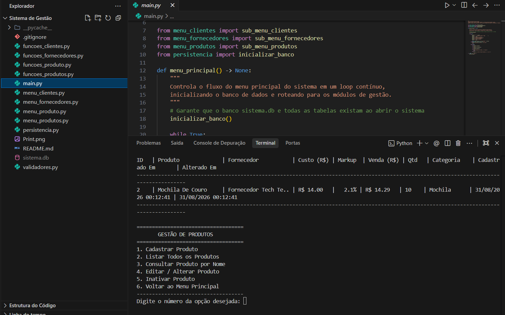

# 🏢 Sistema de Gestão Empresarial Multi-Filiais (ERP CLI)

Sistema completo de gestão comercial e controle de estoque multi-estabelecimentos desenvolvido em **Python** com persistência em **SQLite**. O projeto utiliza uma arquitetura modular em camadas, separando as responsabilidades de interface de linha de comando (CLI), regras de negócio/validação e persistência de dados, com relacionamentos relacionais, controle de concorrência com **transações atômicas**, auditoria de estoque (**Kardex**) e regras de **Soft Delete** (exclusão lógica).

---

## 📸 Demonstração do Sistema



---

## 🛠️ Tecnologias Utilizadas

- **Linguagem:** Python 3.x
- **Banco de Dados:** SQLite3 com suporte a `PRAGMA foreign_keys = ON`, `ON DELETE CASCADE` e constraints de validação (`CHECK`, `UNIQUE`).
- **Resiliência e Segurança:** Context Manager para transações atômicas com `ROLLBACK` automático e mecanismo de *retry* exponencial contra bloqueios de arquivo/disco.
- **Rastreamento Temporal:** Módulo `datetime` para registro de datas de cadastro, alteração cadastral, atualização de preços e timestamps de auditoria de movimentações.
- **Validações:** Validação estrutural de documentos (CNPJ com suporte a isenção), telefones com DDD, e-mails, markups, preços e tipos de movimentações.

---

## 🏗️ Arquitetura do Projeto

A aplicação segue uma estrutura modular para facilitar a manutenção e escalabilidade do código:

```text
Sistema de Gestão/
│
├── sistema.db              # Banco de dados SQLite (gerado e migrado automaticamente)
├── persistencia.py         # Camada de dados (conexão resiliente, transações atômicas, queries e migrações)
│
├── validadores.py          # Validações de entradas (clientes, produtos, filiais, preços, tipos e estoque)
├── funcoes_clientes.py     # Regras de negócio do módulo de Clientes
├── funcoes_fornecedores.py # Regras de negócio do módulo de Fornecedores (com máscara CNPJ)
├── funcoes_produtos.py     # Regras de negócio de Produtos (precificação por loja, saldos e Kardex)
├── funcoes_filiais.py      # Regras de negócio de Filiais (CDs, Lojas Físicas/Virtuais e Transferência)
│
├── menu_clientes.py        # Interface CLI para gestão de Clientes
├── menu_fornecedores.py    # Interface CLI para gestão de Fornecedores
├── menu_produtos.py        # Interface CLI para gestão de Produtos, Preços e Estoque
├── menu_filiais.py         # Interface CLI para gestão de Filiais e Centros de Distribuição
└── main.py                 # Ponto de entrada do sistema (Menu Principal)
```

---

## 🚀 Funcionalidades por Módulo

### 🏬 1. Módulo de Filiais e Centros de Distribuição (CDs)
- **Classificação de Unidades:** Suporte a **Lojas Físicas**, **Centros de Distribuição (CD / Depósito)** e **Lojas Virtuais (E-Commerce)**.
- **Flexibilidade Cadastral:** Código único de identificação (ex: `CD-MATRIZ`, `LOJA-01`, `ECOM`), Nome Fantasia, Razão Social, Telefone e Endereço.
- **CNPJ com Isenção:** Aceita CNPJs formatados no padrão `XX.XXX.XXX/XXXX-XX` ou o valor `0` para unidades virtuais ou sem CNPJ próprio.
- **Auto-vínculo de Produtos:** Ao cadastrar uma nova filial, todos os produtos já ativos ganham automaticamente suas tabelas de preços e saldos (zerados) inicializadas.
- **Transferência de Estoque entre Unidades (CD ➔ Loja):**
  - Permite transferir mercadorias de uma filial de origem para uma filial de destino em uma única transação atômica.
  - Registro automático no Kardex com `TRANSFERENCIA_SAIDA` e `TRANSFERENCIA_ENTRADA`.
- **Trava de Segurança na Inativação:** Impede a inativação de uma filial caso ela ainda possua saldo positivo de mercadorias em estoque (`quantidade > 0`).

---

### 📦 2. Módulo de Produtos, Preços e Estoque Segregado
- **Separação de Saldos por Filial:** A quantidade em estoque foi desacoplada da tabela de produtos e agora é mantida por filial na tabela `saldos` (com suporte a estoque mínimo e alertas de reposição).
- **Tabela de Preços e Promoções por Loja:**
  - Precificação independente por filial na tabela `precos`.
  - **Promoções Exclusivas:** Permite ativar um preço promocional para a **Loja A** (ex: R$ 35,00) mantendo o preço regular praticado na **Loja B** (ex: R$ 50,00).
- **Markup Multiplicador e Recálculo Automático:**
  - Cálculo automático: $\text{Preço de Venda} = \text{Preço de Custo} \times \text{Markup}$.
  - Se markup for `0`, permite a digitação manual do preço de venda final.
- **Vínculo Obrigatório com Fornecedores:** Bloqueia o cadastro caso não existam fornecedores ativos cadastrados.
- **Rastreamento Temporal de Auditoria:** Rastreamento de `data_cadastro`, `data_alteracao` e `data_atualizacao_preco`.

---

### 📊 3. Auditoria de Estoque (Kardex)
- **Histórico Completo de Movimentações:** Rastreamento cronológico de todas as alterações de estoque na tabela `movimentacoes_estoque`.
- **Tipos de Movimentação Suportados:**
  - `CADASTRO_INICIAL`: Saldo inicial definido no cadastro do produto.
  - `ENTRADA`: Compras de fornecedores ou devoluções.
  - `SAIDA`: Vendas ou baixas por avaria (com trava estrita contra saldo negativo).
  - `AJUSTE`: Acertos e reconciliações de inventário físico.
  - `TRANSFERENCIA_SAIDA` e `TRANSFERENCIA_ENTRADA`: Transferência entre CD e Lojas.
- **Extrato Kardex Detalhado:** Consulta com saldo anterior, quantidade movimentada, novo saldo, data/hora e justificativa/motivo da operação.

---

### 👥 4. Módulo de Clientes
- **Cadastro Completo:** Nome validado (apenas caracteres alfabéticos), idade (1 a 119 anos), sexo (M/F/O), e-mail estruturado e telefone com DDD formatado.
- **Listagem e Busca Parcial:** Consulta por termo no nome (`LIKE`).
- **Edição e Soft Delete:** Alteração de dados cadastrais e exclusão lógica (`ativo = 0`).

---

### 🏭 5. Módulo de Fornecedores
- **Cadastro com Máscara de CNPJ:** Formatação e validação no padrão `XX.XXX.XXX/XXXX-XX` com constraint de unicidade (`UNIQUE`).
- **Consultas Rápidas:** Busca por CNPJ formatado ou apenas dígitos, além de busca por Razão Social ou Nome Fantasia.
- **Edição e Inativação Lógica:** Preservação de dados para integridade de produtos vinculados.

---

### 🛡️ 6. Trava de Segurança e Resiliência de Conexão
- **Transações Atômicas:** Todas as operações multi-tabela (ex: salvar produto + preço + saldo + Kardex) são executadas sob o context manager `transacao_banco()`. Em caso de erro, ocorre `ROLLBACK` automático sem deixar registros órfãos.
- **Retry Automático:** Em caso de bloqueio temporário de arquivo (`sqlite3.OperationalError`), o sistema realiza até 3 tentativas com backoff antes de interromper com aviso amigável.
- **Migração Transparente:** O banco migra automaticamente tabelas de versões anteriores ao inicializar o sistema.

---

## ⚙️ Como Executar

1. Certifique-se de ter o Python 3.10+ instalado em seu sistema.
2. Abra o terminal no diretório do projeto e execute:

```bash
python main.py
```

> **Nota:** O arquivo de banco de dados `sistema.db` será criado e inicializado automaticamente com as tabelas, índices e filiais padrão na primeira execução.

---

## 📝 Licença
Este projeto foi desenvolvido para fins educacionais, comerciais e de estudo de boas práticas de arquitetura de software e engenharia de dados em Python.